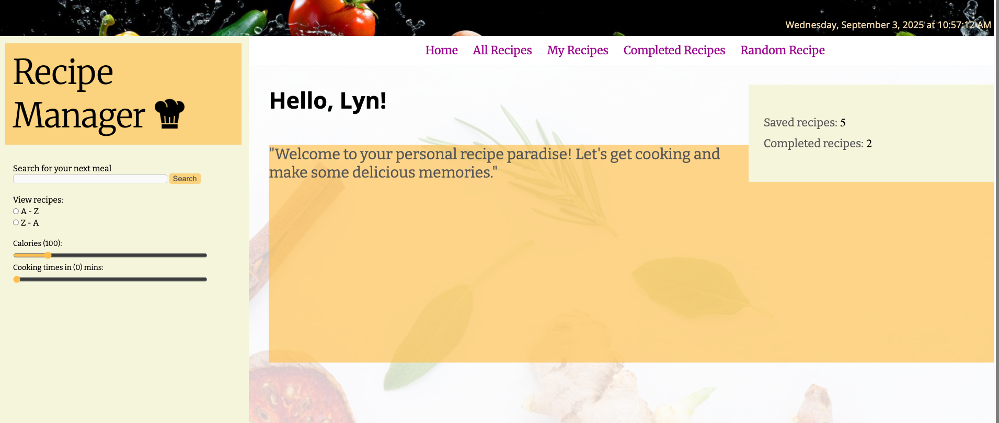
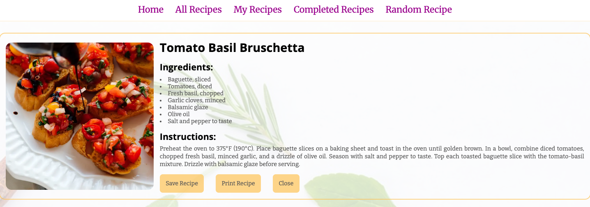
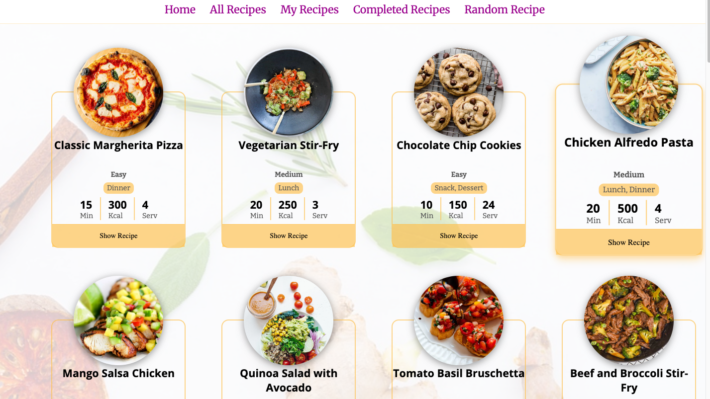

## Project Title

Recipe Manager

## Project Description

The Recipe Manager allows the user to go through a collection of recipes. The user is able to sort and filter the results received from searching. The ability to save, print, delete, and mark the recipes as complete are also available.

This project was created to showcase usage of Local Storage, DOM manipulation, and fetching JSON data saved locally and/or through an API request.

## Technologies Used

Used HTML, CSS, and JavaScript

## How to Install and Run:

Clicking the GitHub pages link automatically starts up the project.

## How to Use:

The user is welcomed by a dashboard showing the number of saved and completed recipes.

The user can visit the "My Recipes' link to view all incomplete recipes saved in the browser's local storage if there's any.

Once a recipe is marked completed, it moves to the 'Completed Recipes' link.
The user can also browse recipes by clicking 'All Recipes' or doscover more by using the search field.

## Credits/Acknowledgments (Optional but Recommended):

Iconixar for the chef icon.
Unsplash for background images.
TheMealDB.com for free recipe API and database

## License (Optional but Recommended):

Indicate the license under which your project is distributed (e.g., MIT, Apache 2.0).
